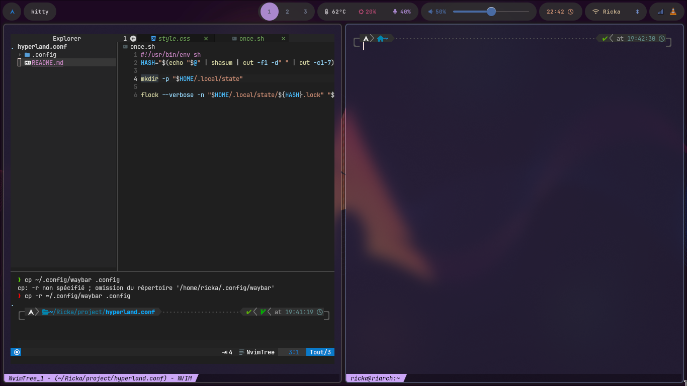

# Archlinux Hyperland config (based on this config: https://github.com/kirisaki-vk/hyprland_TUF_dotfiles)

### Deps
- wofi (app launcher)
- waybar (top bar)
- kitty (terminal)
- ttf-jetbrains-mono-nerd (font)
- swaybg (wallpaper)
- brightnessctl (brightness)
- network-manager-applet (network)
- pamixer (audio)
- swappy (screenshot)
- grim (screenshot)
- wl-clipboard (clipboard)
- swaylock (lock screen)
- swaylock-effects (lock screen)
- wlogout (logout session)
- btop (task manager)
